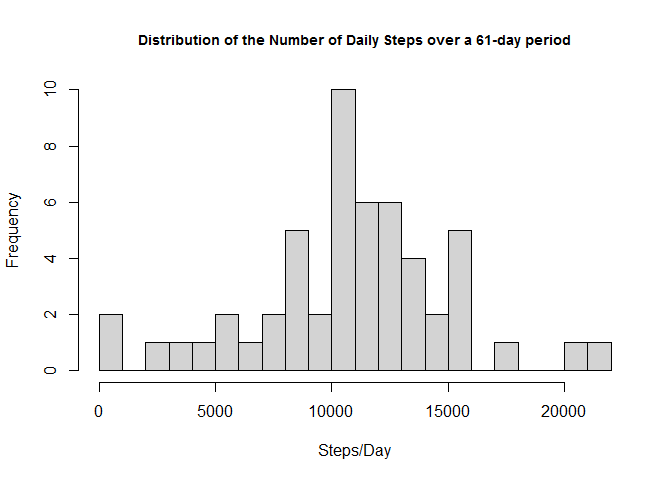
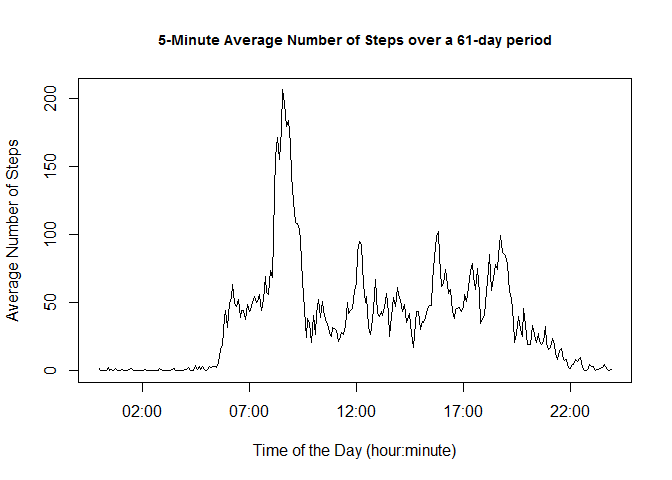
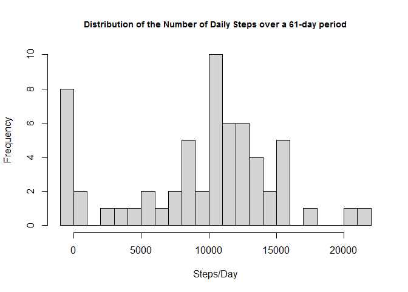
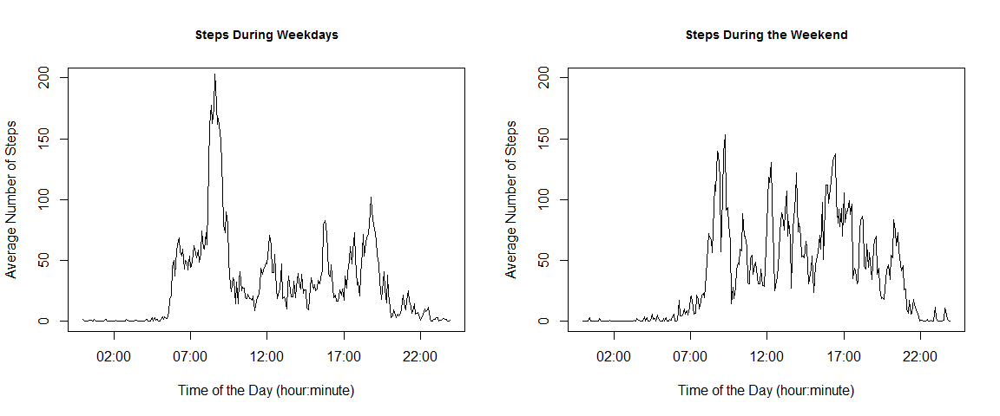

# Reproducible Research: Peer Assessment 1
RutgerD  
April 9 2016  


### *Introduction*
This document contains a short analysis on data collected by a single individual during the months of October and November, 2012. During this period, the individual carried a personal activity monitoring device, and the dataset includes the number of steps taken in 5 minute intervals each day.
In this analysis, we will address the following points:

1. What are the mean and median steps taken per day, across the 61-day period?
2. What is the average daily activity pattern?
3. Which interval has on average the most steps?
4. Does the dataset contain missing values? If so, does replacing these by imputed values affect the outcome of the analysis?
5. Are there differences in activity patterns between weekdays and weekends?


### *Loading and preprocessing the data*
A zip-file containing the data was obtained from the [Github repository](https://github.com/rdpeng/RepData_PeerAssessment1) of Dr. R.D. Peng. It was downloaded on 04-07-2016.

Unless the dataset has already been read into the workspace, it may need to be unzipped and read into the workspace:

```r
if(!file.exists("./activity.csv")) {
    unzip("./repdata-data-activity.zip")
}
if(!exists("act")) {
    act <- read.csv("activity.csv")
}
```
The data does not need any preprocessing as it is tidy and clean. There are missing values, however. These will be adressed later on.


### *What are the mean and median total number of steps taken per day?*
These values will be calculated next. Any missing values will be not taken into account.

```r
sum.act <- aggregate(steps~date, act, sum, na.rm=TRUE)
mean.act <- mean(sum.act$steps)         # mean total number of steps
median.act <- median(sum.act$steps)     # median total number of steps
```
The mean and median of the total number steps taken per day over the 61-day period, were 10766.2 and 10765, respectively.


The distribution of the number of daily steps can be visualized in the following histogram:

```r
hist(sum.act$steps,
        breaks=22,
        xlab="Steps/Day",
        main="Distribution of the Number of Daily Steps over a 61-day period",
        cex.main = 0.9,
        col="light grey")
```

<!-- -->

### *What is the average daily activity pattern?*
Next, we are interested in the average daily activity pattern. This is best visualized by plotting the average number of steps taken per 5-minute interval, averaged across the whole 61-day period.

```r
# Create mean for each interval across all days
avg.act <- aggregate(steps~interval, act, mean, na.rm=TRUE)

# Make vector with correct time format and append to avg.act data frame
hm <- format(seq.POSIXt(as.POSIXct(Sys.Date()),
                        as.POSIXct(Sys.Date()+1), by = "5 min"),
             "%H:%M", tz="GMT")
hm <- as.POSIXct(hm, "%H:%M", tz="")
avg.act$interval1 <- (hm[1:288])

# Create plot
plot(steps ~ interval1, data= avg.act,
     type="l",
     xlab="Time of the Day (hour:minute)",
     ylab="Average Number of Steps",
     main="5-Minute Average Number of Steps over a 61-day period",
     cex.main=0.9)
```

<!-- -->

```r
# Maximum average number of steps taken
max <- format(avg.act[which.max(avg.act$steps),][,2], digits=4)    # maximum
max.int <- format(avg.act[which.max(avg.act$steps),][,3], "%H:%M") # interval of maximum
```

The maximum average number of steps taken over the 61-day period was 206.2, at 08:35.


### *Imputing missing values*
As mentioned above, there are quite some missing values in the dataset. More specifically, there are 2304 missing values in the dataset. This represents 13.1 percent of the total.

It may be relevant to substitute these missing values by imputed values. One method of doing this is interpolating between existing values using the na.spline function from the "zoo" package, and generating a new dataset with with the interpolated values:

```r
require(zoo)
# Make new dataset and replace NA values with interpolated values
act1 <- act
act1$steps<-na.spline(act1$steps)
```
Again, the mean and median number of the total number of steps taken per day were calculated, this time using the dataset with the imputed values:

```r
sum.act1 <- aggregate(steps~date, act1, sum)
mean.act1 <- mean(sum.act1$steps)
median.act1 <- median(sum.act1$steps)
percent.increase.mean <- format(abs((mean.act1-mean.act)*100/mean.act), digits=3)
percent.increase.median <- format(abs((median.act1-median.act)*100/median.act), digits=3)
```

For the dataset where missing data were filled in, the mean and median number of steps taken per day were 9349.04 and 10395, respectively. This represents a 13.2 percent decrease for the mean and a 3.44 percent decrease for the median, respectively from the original data.

The distribution of number of daily steps is shown in the histogram below:

```r
hist(sum.act1$steps,
        breaks=22,
        xlab="Steps/Day",
        main="Distribution of the Number of Daily Steps over a 61-day period",
        cex.main = 0.9,
        col="light grey")
```

<!-- -->

When compared to Plot 1, it transpires that the missing values are essentially all replaced by zero, or a very low value by the interpolations. It unlikely that during these days there was no activity at all, and most likely the personal activity device way switched off during those days.  that the values are only missing during periods of very low activity.


### *Are there differences in activity patterns between weekdays and weekends?*
A difference in activity pattern between weekdays and weekends would seem likely, but can it be inferred from the current activity dataset?
In order to address this question, the dataset with the interpolated values for missing data was split into two: one for weekdays, and one for days of the weekend, and plots were created for both variables:

```r
Sys.setlocale("LC_ALL", "English")
```

```
## [1] "LC_COLLATE=English_United States.1252;LC_CTYPE=English_United States.1252;LC_MONETARY=English_United States.1252;LC_NUMERIC=C;LC_TIME=English_United States.1252"
```

```r
# Create a factor variable in the dataset with two levels - "weekday" and "weekend"
act1$weekday <- as.factor(weekdays(as.Date(act1$date), abbreviate=TRUE))
levels(act1$weekday)[levels(act1$weekday) == "Sun"] <- "weekend"
levels(act1$weekday)[levels(act1$weekday) == "Sat"] <- "weekend"
levels(act1$weekday)[levels(act1$weekday) != "weekend"] <- "weekday"

# Create mean for each interval across both levels
avg.act1 <- aggregate(steps~interval+weekday, act1, mean)

# Append vector with correct time format to act1 data frame
avg.act1$interval1 <- (hm[1:288])

# Create plots
par(mfrow=c(1,2))
plot(steps ~ interval1,
        data=subset(avg.act1, avg.act1$weekday=="weekday"),
        type="l",
        xlab="Time of the Day (hour:minute)",
        ylab="Average Number of Steps",
        main="Steps During Weekdays",
        ylim=c(0,200),
       cex.main=0.9)
plot(steps ~ interval1,
      data=subset(avg.act1, avg.act1$weekday=="weekend"),
      type="l",
      xlab="Time of the Day (hour:minute)",
      ylab="Average Number of Steps",
      main="Steps During the Weekend",
      ylim=c(0,200),
      cex.main=0.9)
```

<!-- -->

It is clear that the pattern is different on weekdays compared to weekends. In particular, the peak around 8:30 which is found during weekdays is absent in the weekend.
